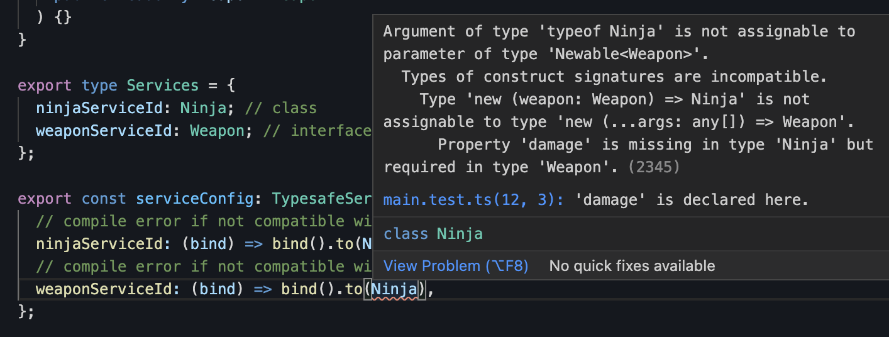
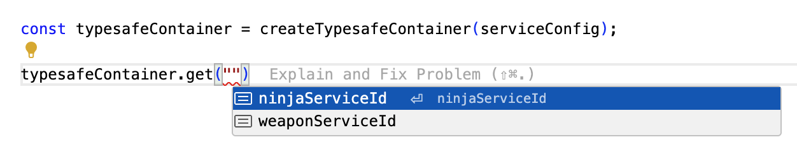
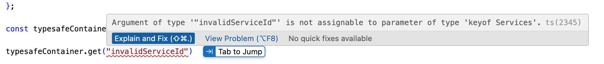
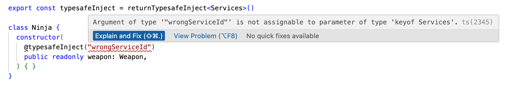

<h1 align="center">inversify-typesafe</h1>

<p align="center">
  Boost <a href="https://inversify.io/" target="_blank">InversifyJS</a> with Type Safety. <br/>
  <a href="https://stackblitz.com/edit/inversify-typesafe?file=test%2Fmain.test.ts" target="_blank">
    <strong>See Demo</strong>
  </a>
</p>

<p align="center">
  <a href="https://github.com/myeongjae-kim/inversify-typesafe/actions?query=workflow%3ACI">
    
  </a>
  <a href="https://codecov.io/gh/myeongjae-kim/inversify-typesafe">
    
  </a>
  <a href="https://www.npmjs.com/package/inversify-typesafe">
    
  </a>
  <a href="https://bundlephobia.com/package/inversify-typesafe">
    
  </a>
  <a href="https://raw.githubusercontent.com/myeongjae-kim/inversify-typesafe/main/LICENSE">
    
  </a>
</p>

```ts
import { createTypesafeContainer, returnTypesafeInject, TypesafeServiceConfig } from "inversify-typesafe";

// https://inversify.io/docs/introduction/dependency-inversion/
interface Weapon {
  damage: number;
}

class Katana implements Weapon {
  public readonly damage: number = 10;
}

export const typesafeInject = returnTypesafeInject<Services>()

class Ninja {
  constructor(
    @typesafeInject("weaponServiceId") // compile error if a parameter value is not a key of Services
    public readonly weapon: Weapon,
  ) { }
}

export type Services = {
  "ninjaServiceId": Ninja; // class
  "weaponServiceId": Weapon; // interface
};

export const serviceConfig: TypesafeServiceConfig<Services> = {
  // compile error if not compatible with Ninja
  "ninjaServiceId": (bind) => bind().to(Ninja),
  // compile error if not compatible with Katana. Use the second parameter if you need to access the container
  "weaponServiceId": (bind, _container) => bind().to(Katana),
};

const typesafeContainer = createTypesafeContainer(serviceConfig);

console.log(typesafeContainer.get("ninjaServiceId").weapon.damage);
```

## Background

[InversifyJS](https://inversify.io/) is a powerful and lightweight inversion of control container for JavaScript & Node.js apps powered by TypeScript. Although it is excellent on its own, adding a few more type declarations allows you to write more type-safe code by leveraging TypeScript's powerful type system. Wouldn't it be great if entering just a service ID automatically infers type of the service, and if entering an unregistered service ID could be magically detected at compile time? I wrote this library to create a type-safe container by exploiting [TypeScript's String Literal Types](https://www.typescriptlang.org/docs/handbook/2/everyday-types.html#literal-types) and introduce a service registration method inspired by [Spring](https://spring.io/).

### Philosophy

In implementing the `inversify-typesafe`, I considered the following points:

1. The library proposes an opinionated service registration method, but it should not limit InversifyJS's features.
2. Users of the library should be able to use all features of InversifyJS whenever they want.
3. While adhering to the above two principles, user mistakes should be caught at compile time as much as possible.
4. The types that the library user needs to declare should be minimized.

### Good Things

- Entering a string service ID into the container automatically infers the registered type without additional type writing.
- When entering a string into the `get` method to find a service, you can check registered service IDs via autocomplete in your code editor.
- Compile-time errors occur if you enter a service ID that is not registered in the container.
- Compile-time errors occur if you enter an unregistered service ID when injecting a service.
- No additional peer dependencies. Just `inversify` and `reflect-metadata`.
- 100% test coverage.

## Installation

Via npm

```bash
npm install inversify-typesafe
```

Via yarn

```bash
yarn add inversify-typesafe
```

Via pnpm

```bash
pnpm add inversify-typesafe
```

## Demo

Try it out on <a href="https://stackblitz.com/edit/inversify-typesafe?file=test%2Fmain.test.ts" target="_blank">Stickblitz</a>.

## Types

https://inversify-typesafe.myeongjae.kim/modules.html

## Usage

### 1. Declare `Services` Map Type

```ts
export type Services = {
  "ninjaServiceId": Ninja; // class
  "weaponServiceId": Weapon; // interface
};
```

Users should write `Services`(or whatever name you want) map type to declare the services that will be registered in the container. The keys of the `Services` type are used as service IDs. While InversifyJS registers various types (`class`, `symbol`, etc.) as service IDs, `inversify-typesafe` uses only `string` types as service IDs. Using `string` allows exploiting [TypeScript's String Literal Types](https://www.typescriptlang.org/docs/handbook/2/everyday-types.html#literal-types) feature to provide magical type safety.

### 2. Write Service Config

```ts
import { TypesafeServiceConfig } from "inversify-typesafe";

export const serviceConfig: TypesafeServiceConfig<Services> = {
  "ninjaServiceId": (bind) => bind().to(Ninja),
  "weaponServiceId": (bind, _container) => bind().to(Katana),
};
```

This library provides a utility type called `TypesafeServiceConfig<T>`. `TypesafeServiceConfig<T>` constrains the keys of type `T` to be used as service IDs. Passing the previously declared `Services` type as the type parameter to `TypesafeServiceConfig` restricts usage to only the keys of the `Services` type. If you enter a key that does not exist in `Services` or do not provide a function for every key in `Services`, a compile-time error occurs, allowing users to write code more safely.

The object's values use lambdas to allow users to utilize all binding features of Inversify. The lambda accepts `bind` as the first parameter and `container` as the second. The first parameter is a [thunk](https://en.wikipedia.org/wiki/Thunk) `() => container.bind(serviceId)` to bind the service ID to the container. Since the thunk to bind the object's key as a service ID is passed as a parameter, the user can choose how to map a service to the service ID. If the user attempts to map a service that is incompatible with the `Services` type declaration, a compile-time error occurs.



The lambda's second parameter receives `container`. For simple cases, using only the first parameter `bind` is sufficient, but you can utilize the second parameter if you need to access the container directly during the service registration process.

### 3. Create Typesafe Container

```ts
import { createTypesafeContainer } from "inversify-typesafe";

const typesafeContainer = createTypesafeContainer(serviceConfig);
```

The `createTypesafeContainer()` function takes an argument of type `TypesafeServiceConfig<T>` and returns `TypesafeContainer<T>`. Users do not need to specify generic type parameters manually.

### 4. Get Service

```ts
const ninjaService = typesafeContainer.get("ninjaServiceId");
```

Passing a key of the user-declared `Services` type as an argument returns the bound service. The return type is inferred well without any additional type writing, and registered service IDs can be checked via autocomplete in the code editor. 



Entering a value that is not a key of `Services` causes a compile error.



### 5. Inject Service

```ts
import { returnTypesafeInject } from "inversify-typesafe";

export const typesafeInject = returnTypesafeInject<Services>()

class Ninja {
  constructor(
    @typesafeInject("weaponServiceId")
    public readonly weapon: Weapon,
  ) { }
}
```

Calling the high order function `returnTypesafeInject<T>()` with the user-declared `Services` type as the type parameter returns a decorator function. Entering a value other than a key of the `Services` type into this decorator's parameter causes a compile error.



### 6. Every InversifyJS feature is possible

```ts
import { ServiceIdentifier } from "inversify";

const ninjaService = typesafeContainer._get("ninjaServiceId" as ServiceIdentifier<Ninja>);
```

The `_get` method of type `TypesafeContainer<T>` performs the same function as the `get` method of the existing `Container` type. You can use the `_get` method when you need the original `get` method rather than the type-safety enhanced function.

All methods except the `get` method are identical to the InversifyJS `Container` type.

## inversify-typesafe-spring-like

Add-On Library for inversify-typesafe to make it more like Spring.

https://github.com/myeongjae-kim/inversify-typesafe/tree/main/packages/inversify-typesafe-spring-like

Try it out on <a href="https://stackblitz.com/edit/inversify-typesafe-spring-like?file=test%2Fmain.test.ts" target="_blank">Stickblitz</a>.

## License

MIT © [Myeongjae Kim](https://myeongjae.kim)